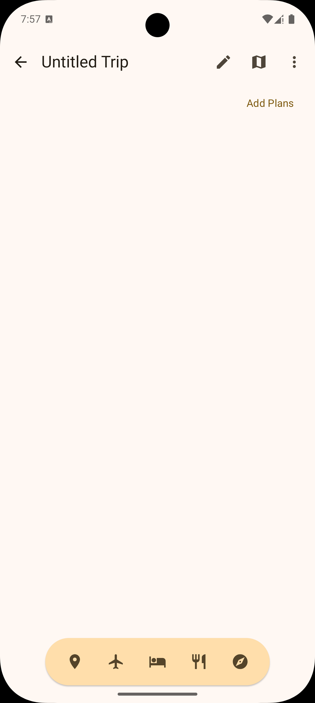
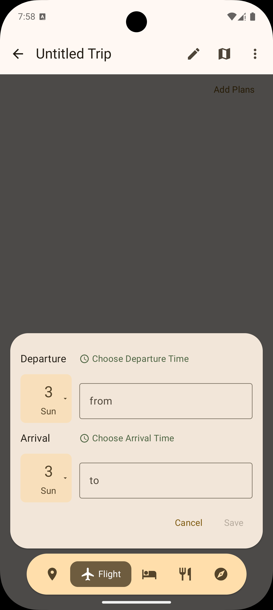
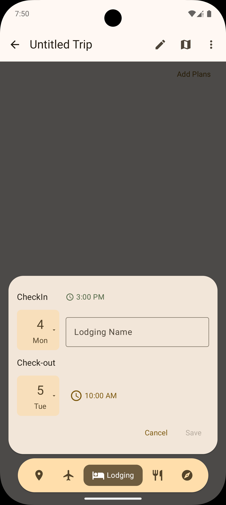
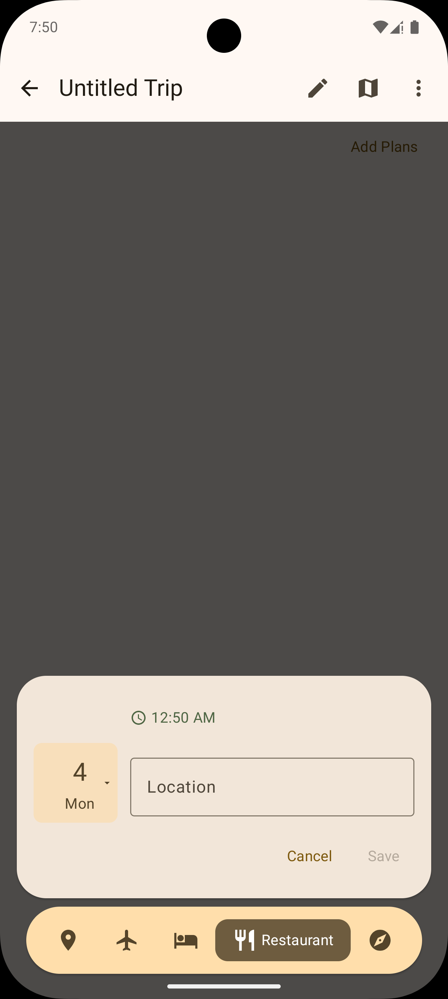
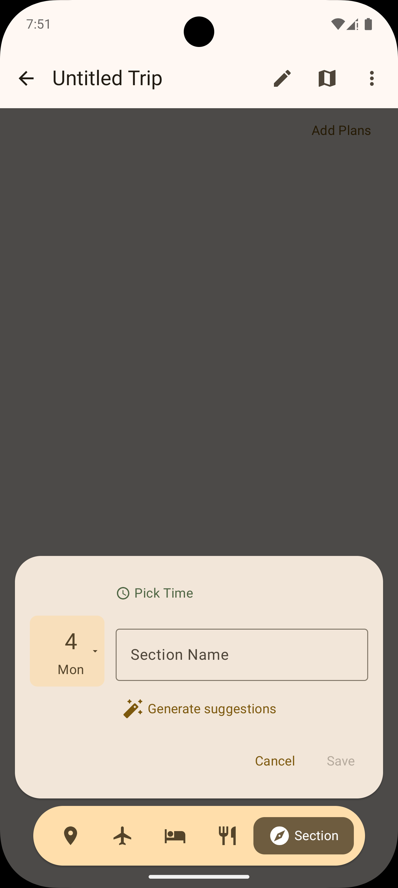
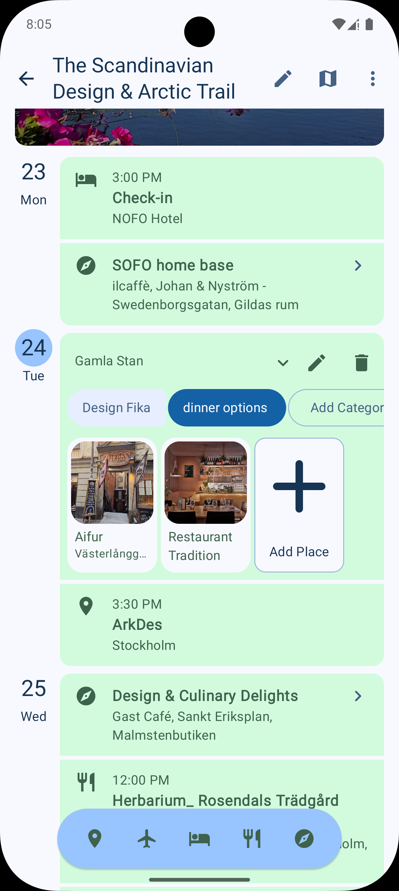
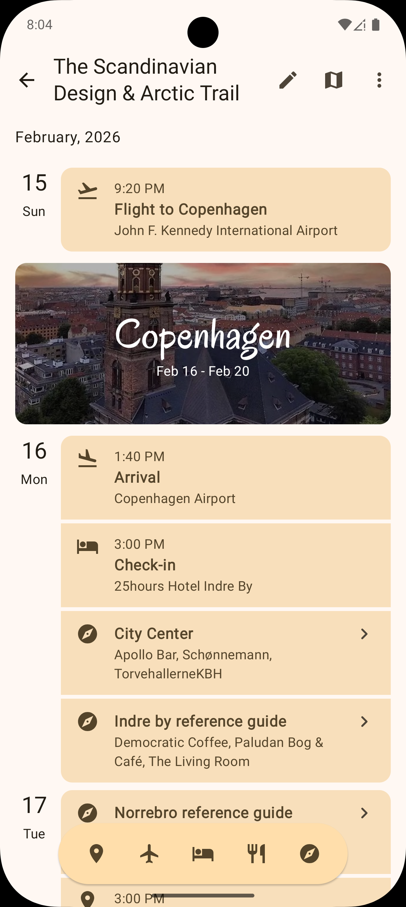
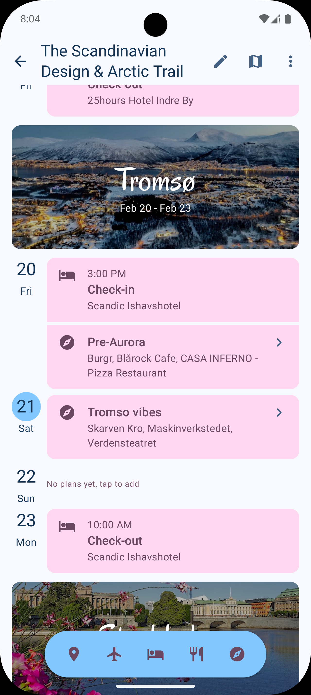
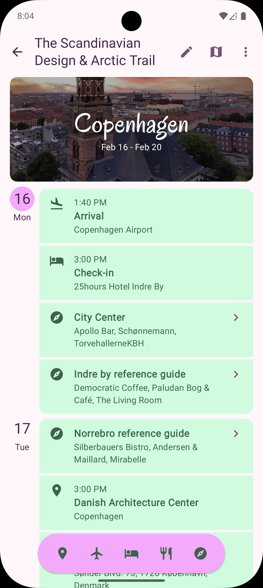

# Product Specification: Vola Travel App (Android)

## 1. Overview
Vola is a travel planning application designed to help users organize multi-city trips. It provides a centralized, chronological itinerary where users can manage flights, accommodations, dining, and sightseeing activities. The app is built to facilitate seamless travel planning with a focus on ease of use and clear visualization of the journey.

## 2. Core Functionalities

### 2.1 Trip Management
The app serves as a container for multiple trips, allowing users to organize different journeys separately.

- **Trip Listing**: A high-level view showing all created trips.
- **Trip Creation**: Users can start a new trip at any time. New trips are initialized with a placeholder name, allowing users to define the journey's scope later.
- **Trip Renaming**: Users can customize the name of their trip (e.g., "Summer in Japan 2024") to make it easily identifiable.
- **Trip Deletion**: Users can remove a trip entirely, which also deletes all associated itinerary events.

### 2.2 Itinerary Planning
The itinerary is the heart of the application, presenting a chronological timeline of all planned events.

#### 2.2.1 Flight Management

- **Departure Details**: Users specify the date, time, and departure airport.
- **Arrival Details**: Users specify the date, time, and arrival airport.
- **Airport Search**: An intelligent search field with auto-completion for airports worldwide. Suggestions are triggered after the user types at least three characters.
- **Validation**: To ensure data integrity, the arrival time must be at least one hour after the departure time. The "Save" action is only enabled once valid airports and times are selected.

#### 2.2.2 Lodging Management (Accommodations)

- **Check-in**: Users define the arrival date and time at their accommodation. The default check-in time is 15:00.
- **Check-out**: Users define the departure date and time. The default check-out time is 10:00 on the following day.
- **Location Identification**: Users identify the lodging by name or address. A search-as-you-type feature provides address suggestions to help resolve the precise location (address and coordinates).
- **Validation Rules**:
    - Both check-in and check-out dates and times must be explicitly defined.
    - Check-out must occur after the check-in time, with a minimum duration of one day.
    - A valid address and geographic coordinates must be captured for each entry.
    - The "Save" action is disabled until all timing and location requirements are satisfied.
- **Editing and Deletion**: Existing lodging entries can be modified or removed at any time from the itinerary view.

#### 2.2.3 Place Visit Management (Sightseeing)
- **Activity Timing**: Users can set a start date and time for a visit. An optional end time can also be specified.
- **Location Search**: Search functionality for cities and specific points of interest (POIs).
- **Validation**: If an end time is provided, it must be later than the start time.

#### 2.2.4 Restaurant Reservation Management

- **Dining Time**: Users specify the date and time of the reservation.
- **Restaurant Search**: A dedicated search for restaurants with auto-completion for names and locations.

#### 2.2.5 Flexible Planning (Flexible Sections)
Flexible sections allow users to brainstorm and group multiple options for a specific day without assigning them strict times.

- **Section Naming**: Users provide a descriptive name for the section (e.g., "Afternoon in Shinjuku").
- **Date Association**: Each section is assigned to a specific day in the itinerary.
- **Categorization**:
    - Users can create multiple custom categories within a section (e.g., "Coffee Shops," "Parks," "Exhibitions").
    - Categories serve as buckets for grouping related travel options.
- **Item Management**:
    - **Place Addition**: Users search for and add specific places (points of interest, establishments) to any category.
    - **Personalized Notes**: Users can add custom notes to any item within a category to capture reminders or specific recommendations.
- **Visualization**: Flexible sections appear in the itinerary as grouped clusters of options, providing a "choose your own adventure" feel for parts of the trip.

### 2.3 Add Plan Toolbar
The Add Plan Toolbar is a persistent floating component that allows users to insert new events into their itinerary efficiently.

- **Intelligent Pre-population**: To minimize data entry, the toolbar uses the user's current view of the itinerary to predict the desired timing and location of a new plan.
- **Dynamic Date Auto-fill**:
    - When a user initiates a new plan from the toolbar, the system identifies the "focused" event currently displayed on the screen (determined by the scroll position).
    - The starting date and time for the new entry are automatically set to the timestamp of the focused event.
- **Smart Location Context**:
    - The system analyzes the existing itinerary to identify the most likely city for the selected time.
    - It searches for existing events occurring on the same day or the event immediately preceding the new plan's time slot.
    - The city associated with this reference event is then suggested as the starting location for the new activity or lodging.
- **Workflow Efficiency**: This ensures that when a user scrolls to a specific day in their trip and taps "Add Restaurant," the app is already prepared with the correct date and local city context.

### 2.4 Itinerary Experience
The itinerary experience is designed to be highly visual, providing a chronological timeline that is easy to navigate and understand.

#### 2.4.1 Sorting Logic
The itinerary follows a comprehensive sorting system to ensure the timeline reflects a realistic travel flow, especially when multiple events occur on the same day.

1. **Primary Sort**: All events are sorted chronologically by their date and time.
2. **Secondary Sort (Same Day)**:
   - **Intra-city events**: When events occur within the same city on the same day, they follow this priority:
     1. Arrivals (e.g., flight landings).
     2. Check-ins / Check-outs (e.g., hotel check-in/out).
     3. Activities and Dining (e.g., museum visits, restaurant reservations).
     4. Departures (e.g., flight take-offs).
   - **Inter-city transitions**: When transitioning between cities on the same day, the priorities shift to maintain logical flow:
     1. Check-outs from the previous location.
     2. Departure from the previous location.
     3. Arrival at the new location.
     4. Check-in at the new location.
     5. Activities and Dining at the new location.

#### 2.4.2 Visual Components and Display Rules
The itinerary is composed of several specialized visual components, each governed by specific display logic:

- **Month Headers**: Displayed at the start of the itinerary and whenever the month changes between two consecutive events.
- **City Banners**: These provide a high-level overview of the time spent in a specific location.
  - **Display Rule**: A city banner is shown when the location of the current event is different from the previous one.
  - **Exceptions**: Banners are not shown for "day trips" (short visits within a single day) or for the final return to the origin city.
- **Event Cards**: Distinctive visual blocks for each plan type:
  - **Flight Cards**: Show departure/arrival times, airport names, and destination city (for departures).
  - **Lodging Cards**: Separate cards for Check-in and Check-out, showing hotel name and address.
  - **Place Cards**: Show activity name, time (if set), and city.
  - **Restaurant Cards**: Show reservation time, restaurant name, and address.
- **Timeline Gaps**:
  - **Single Empty Day**: Shown when there is a one-day gap between scheduled plans.
  - **Date Range Gap**: Shown for gaps spanning two or more days, displaying the start and end dates of the unscheduled period.
- **Initial State**: If a trip has no plans, a placeholder is displayed inviting the user to add their first flight or lodging.

#### 2.4.3 Dynamic City-Based Theming
The application employs a dynamic theming system that visually adapts the interface to the specific location being explored in the itinerary.

- **Visual Trigger**: As the user scrolls through the itinerary, the app tracks which city is currently "focused" based on the scroll position.
- **Seed Color Extraction**: For every city banner (Place Card) displayed in the itinerary, the app extracts the dominant color from its associated cover image.
- **Theme Adaptation**:
    - The extracted dominant color is used as the "seed color" for the application's color scheme.
    - The entire trip details interface (backgrounds, buttons, icons, and text highlights) smoothly transitions to match the new color scheme.
    - Both light and dark modes are supported, with the dynamic scheme adjusting accordingly to maintain accessibility and visual harmony.
- **User Experience**: This provides a cohesive and immersive feeling for each stage of the journey, visually differentiating different destinations in a multi-city trip.

## 3. General Requirements

### 3.1 Data Management
- **Persistence**: All trip and itinerary data must be saved locally or on Firebase Firestore and persist across app sessions.
- **Editing and Deletion**: Every item added to the itinerary (Flight, Lodging, Place, Restaurant) must be editable or removable at any time.

### 3.2 User Interface (UI)
- **State-Driven UI**: Interactive elements like the "Save" button must reflect the validity of the current input (e.g., disabling if required fields are missing).
- **Search Experience**: All search-based fields (Airports, Hotels, Places, Restaurants) must provide a responsive auto-complete experience to reduce user friction.
- **Visual Hierarchy**: The design should emphasize the sequence of the trip, using icons and clear typography to distinguish between different types of events.
